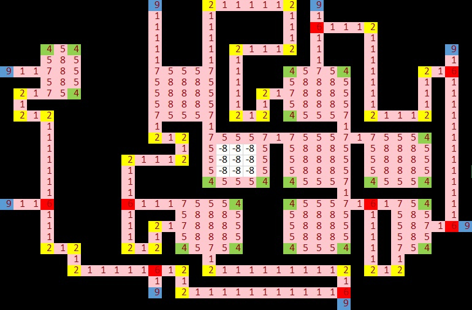

<h1 style="text-decoration: underline"> Лабиринт Минотавра</h1>
<ul id ="about_list">
    <li><a href="#game_rules">Правила игры</a></li>
    <li><a href="#player"> Игрок </a></li>
    <li><a href="#items">Игровые предметы</a></li>
    <li><a href="#minotaur">Минотавр</a></li>
    <li><a href="#labyrinth">Лабиринт</a></li>
    <li><a href="#how_to_play">Как начать играть</a></li>
</ul>

Многопользовательская игра, написанная на языке clojure. Суть игры заключается в том, чтобы дойти до **Safe Zone**. По
лабиринту ходит Минотавр, за которого играет бот. Будьте аккуратны, так как Минотавр имеет преимущества по сравнению с
обычными пользователями, а так же встреча с ним будет для вас фатальна.

<h2 style="color:#ccbb14" id="game_rules"><a href="#about_list"> Правила игры </a></h2>

Пользователь присоединяется к игре в любой момент времени, перед началом хода. Места появления игрока заранее определены
на карте. За один тик сервера каждый может сделать только одно действие ***(перемещение, подобрать предмет, начать
драку, остаться на месте)***. Тик сервера происходит каждые 15 секунд, чтобы каждый из пользователей мой успеть
обработать свой ход. Область видимости ограничена как у игрока, так и у Минотавра Бориса, на старте игры условия не
равны (в пользу Минотавра Бориса). 

###forDev: В первую очередь будут обрабатываться команды на сражение, затем на движение

По лабиринту разбросаны Игровые предметы, которые улучшают игровые характеристики персонажа (область видимости, сила
атаки, запас здоровья). Так же у каждого игрока на одну партию есть особый блок **"Стенка"**, который можно поставить в
проходе и тогда никто не сможет пройти на протяжении 3-х ходов, за это время игрок может успеть убежать или сменить
маршрут, чтобы не пересечься с Минотавром Борисом.

Как только один из игроков достигает центра карты **Safe Zone** игра перезапускается и начинается с начала. Все игроки
появляются в местах спавна, а Минотавр Борис в центре карты, откуда он и начнёт охоту на игроков.

<h2 style="color:#8cc733" id="player"> <a href="#about_list"> Игрок </a></h2>
На старте игры персонаж имеет 100 ед. здоровья и 5 ед. урона, а так же ряд предметов:
<ul>
    <li> Одежда путника (имеет запас 10 ед. брони)</li>
    <li> Зажигалка (имеет область видимости на 3 клетки во все стороны)</li>
    <li> Уникальный предмет <b>Стенка</b> (устанавливается в любом месте в пределах радиуса видимости)</li>
    <li> Перочинный ножик (имеет силу атаки 25 ед.)</li>
    <li> Сандали (имеют дальность передвижения 2 клетки)</li>
</ul>

Если в начале хода игрок **находится на клетке с предметом**, то он может осмотреть предмет и его характеристики, если
предмет ему подходит, то его можно экипировать и это не будет считаться за ход (значит после он сможет совершить
действие перемещения).

Если игрок выбрал действие **Атаковать игрока**, то действие атакуемого отменяется и начинается битва, в ходе которой
атакующий имеет преимущество первой атаки. Победителю восстанавливается половина здоровья побеждённого, и передаётся
экипировка с лучшими статистическими показателями. 

Если два игрока придут на одну клетку, то автоматически начинается бой и преимущество первого удара будет у игрока, который
последним пришёл на клетку.

Если игрок воспользовался **Установить стенку**, то он просто выбирает место где её поставить, но позиции своей не
меняет.

<h2 style="color:#2997ef" id="items"> <a href="#about_list"> Игровые предметы </a></h2>
<ul>
    <li>
        <h4>
            Фонарик (область видимости 4 клетки во все стороны)
        </h4>
    </li>
    <li>
        <h4>
            Сапоги скороходы (дальность передвижения 3 клетки)
        </h4>
    </li>
    <li>
        <h4>
            Броня гладиатора (запас здоровья 200 ед. брони)
        </h4>
    </li>
    <li>
        <h4>
            Меч гладиатора (50 ед. урона)
        </h4>
    </li>
    <li>
        <h4>
            Бронежилет Картошка (запас здоровья 120 ед. брони)
        </h4>
    </li>
    <li>
        <h4>
            Ядовитый дротик (урон сразу по здоровью 15 ед. урона)
        </h4>
    </li>
    <li>
        <h4>
            ТТ (Тульский Токарев) (100 ед. урона)
        </h4>
    </li>
    <li>
        <h4>
            Аптечка (восстанавливает всё здоровье)
        </h4>
    </li>
</ul>

<h2 style="color:#af1212" id="minotaur"> <a href="#about_list"> Минотавр Борис  </a></h2>

Местный босс локации, который провёл уже не одну сотню лет в этом лабиринте, поэтому дальность видимости у него значительно
лучше, чем у простого обывателя и составляет целых **5 клеток**!!! Оказывается он так же хороший легкоатлет и бегает на целых **4 клетки**!!!
А его оружие вселяет страх во всех путников подземелья и при одном только его виде они **сразу умирают**. Единственное, что может
вас спасти от него, это ведро бетона и блок кирпичей (предмет **Стенка**), который каждый разумный путник носит с собой.

Минотавр Борис очень злой и милый, найдите его и получите приз))

Так как Минотавр - кровожадный убийца, он совершает свой ход после того, как все игроки походят, чтобы выбрать самого вкусного, 
а также чтобы путники подземелья успели построить **Стенку**

<h2 id="labyrinth"> <a href="#about_list"> Лабиринт</a></h2>

Игровая карта (лабиринт) представляет собой множество взаимосвязанных клеток, по которым разрешено перемещаться. Обозначения на карте: 

<li>
    <h4>
        1 - Прямой туннель
    </h4>
    <h4>
        2 - Угол туннеля
    </h4>
    <h4>
        3 - Тупик
    </h4>
    <h4>
        4 - Угол комнаты
    </h4>
    <h4>
        5 - Стенка комнаты
    </h4>
    <h4>
        6 - Развилка
    </h4>
    <h4>
        7 - Выход из комнаты
    </h4>
    <h4>
        8 - Комната
    </h4>
    <h4>
        9 - Победная зона (Safe Zone).
    </h4>
    
    Отрицательные числа указывают, что данная ячейка является точкой спавна. 
    
</li>

<h2 id="how_to_play"> <a href="#about_list">Как начать играть</a> </h2>
